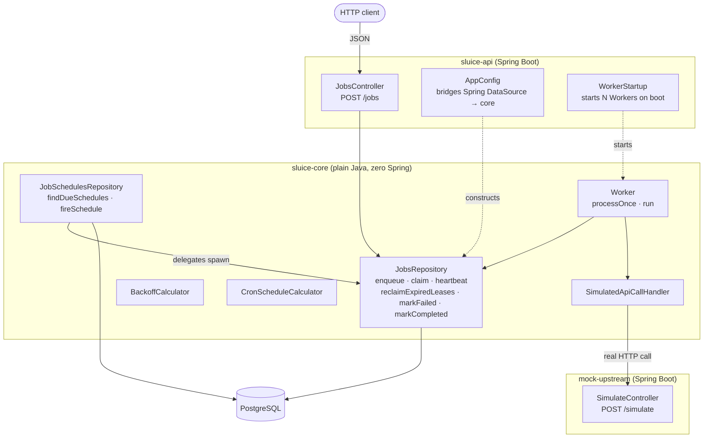
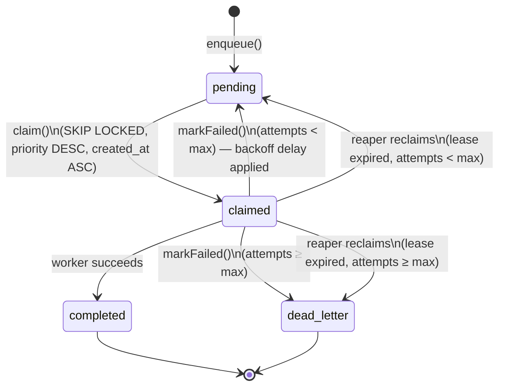
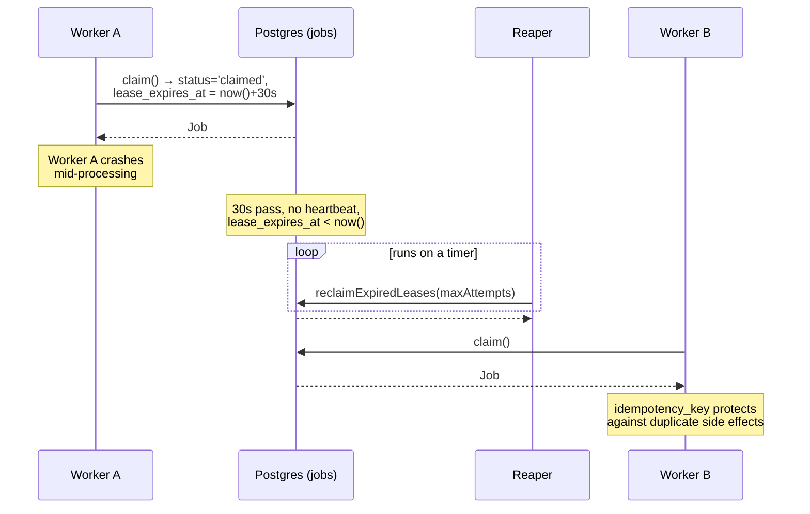
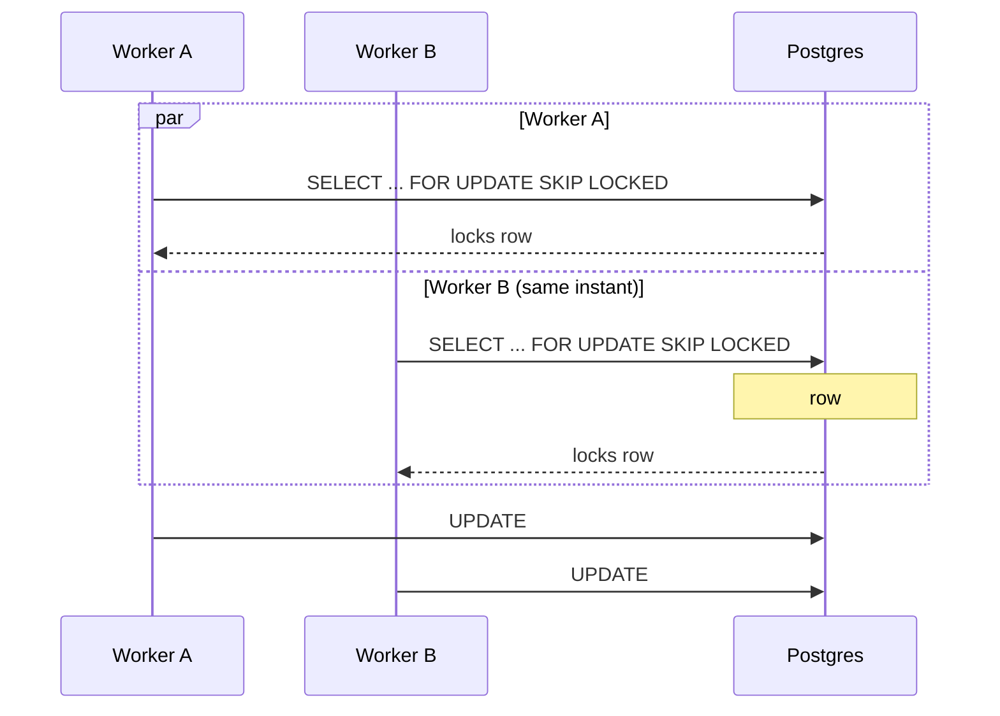
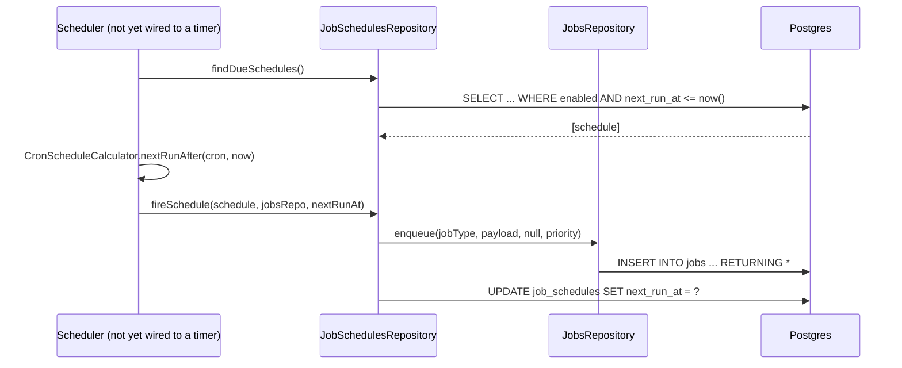
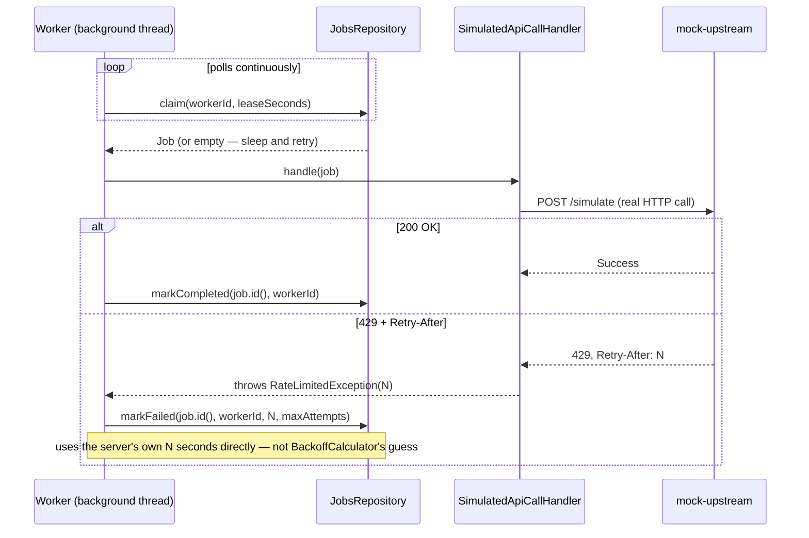
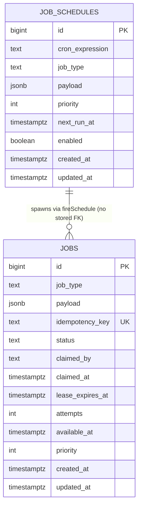

# Sluice

A distributed job scheduler and durable task queue, built in Java, purpose-built for rate-limited external API workloads (LLM APIs, third-party services with 429/Retry-After semantics, anything where "just retry immediately" makes things worse).

The name is a sluice gate: it controls the *rate* at which work flows through, not just whether it flows.

> **Status:** actively under development. Weeks 1–4 are complete — schema through a real, benchmarked worker pipeline running via Docker Compose. Week 5 (metrics dashboard, CI) is the remaining work. See [Project status](#project-status--roadmap) for exact detail on what's done vs. still open.

---

## Table of contents

- [Why this exists](#why-this-exists)
- [Features](#features)
- [Architecture](#architecture)
- [How it works](#how-it-works)
  - [Job lifecycle](#job-lifecycle)
  - [Crash recovery: leases, heartbeats, and the reaper](#crash-recovery-leases-heartbeats-and-the-reaper)
  - [Concurrent claiming with `SKIP LOCKED`](#concurrent-claiming-with-skip-locked)
  - [Recurring schedules](#recurring-schedules)
  - [Autonomous job processing](#autonomous-job-processing)
  - [Schema](#schema)
- [Tech stack](#tech-stack)
- [Running it locally](#running-it-locally)
- [Running the tests](#running-the-tests)
- [Benchmark results](#benchmark-results)
- [Key design decisions](#key-design-decisions)
- [Project status / roadmap](#project-status--roadmap)

---

## Why this exists

Most "backend" side projects are wiring: call this API, save the result, call that API. Sluice is deliberately not that. It exists to answer a narrower, harder question: **what actually happens when a worker dies in the middle of doing something, and how do you build a system that survives that without losing work or doing it twice?**

That question comes directly from calling rate-limited LLM APIs in production — retries, backoff, and "did that request actually succeed before the process died" are not hypothetical problems there. Sluice is the queue that problem deserves, built from first principles on top of plain Postgres rather than bolted onto an existing message broker.

## Features

- **Postgres-backed queue.** No message broker — durability comes from the database itself.
- **Safe concurrent claiming.** Multiple worker processes compete for jobs via `SELECT ... FOR UPDATE SKIP LOCKED`, proven under real multi-threaded contention (not just unit tests).
- **At-least-once delivery.** Time-boxed leases + worker heartbeats + a reaper that reclaims jobs from workers that die silently.
- **Retries with exponential backoff + full jitter.** Failures don't retry instantly or in lockstep with every other failed job.
- **Dead letter queue.** Jobs that exceed a max-attempts threshold stop retrying automatically — via *either* an explicit failure report or a silent worker crash.
- **Idempotency keys.** Enforced atomically at the database level (`ON CONFLICT ... DO NOTHING`) — a duplicate submission returns the original job, never a second row, even under concurrent requests.
- **Job priorities.** Higher-priority jobs are claimed first; equal-priority jobs still respect arrival order.
- **Recurring schedules.** Cron-expression-driven job templates that spawn fresh executions on a real, computed schedule (via [cron-utils](https://github.com/jmrozanec/cron-utils)), independent of whether any individual spawned job succeeds or fails.
- **Autonomous worker pool.** A configurable number of background workers claim and process jobs continuously — started automatically when the app boots, no manual triggering.
- **Rate-limit-aware execution.** A real job handler makes actual HTTP calls to an upstream service; on a 429, it reads the response's own `Retry-After` header and uses that exact value as the backoff — not a guessed exponential delay.
- **One-command deployment.** The full stack (Postgres, the API + workers, and a mock upstream service) runs via a single `docker compose up --build`, built from source via multi-stage Dockerfiles.
- **Measured, not assumed, performance.** A benchmark harness scales workers 1→8 against the mock upstream and records real throughput/p95 latency — see [results](#benchmark-results).
- **HTTP API** to enqueue jobs (`POST /jobs`).

## Architecture

Three Maven modules, split deliberately along a hard boundary:

```
sluice/
├── sluice-core/                 # queue engine — plain Java, zero Spring dependencies
│   ├── JobsRepository           # enqueue, claim, heartbeat, reclaim, markFailed, markCompleted, findById...
│   ├── JobSchedulesRepository   # findDueSchedules, fireSchedule
│   ├── BackoffCalculator        # pure logic: exponential backoff + jitter
│   ├── CronScheduleCalculator   # pure logic: cron expression → next occurrence
│   ├── Worker                   # the processing loop: claim → handle → complete/fail
│   ├── JobHandler                # interface: one job type's actual work
│   ├── SimulatedApiCallHandler   # a real handler — calls mock-upstream over HTTP
│   ├── RateLimitedException      # carries a real Retry-After value from upstream
│   └── db/migration/            # Flyway SQL migrations (travel to sluice-api via classpath)
│
├── sluice-api/                   # Spring Boot HTTP + wiring layer
│   ├── JobsController            # POST /jobs
│   ├── WorkerStartup             # starts the configured number of Workers on boot
│   ├── AppConfig                 # bridges Spring's DataSource → core's Spring-free classes
│   └── application.yml
│
└── mock-upstream/                 # standalone Spring Boot app simulating a rate-limited API
    └── SimulateController          # POST /simulate — configurable latency + 429/Retry-After
```

**Why the split:** `sluice-core` has no Spring dependency at all — not `spring-jdbc`, not `spring-tx`. It talks to Postgres through plain JDBC with manual transaction control. This means:

- Every concurrency and correctness test runs against real Postgres (via Testcontainers) with zero Spring context needed — fast, focused, nothing to configure.
- The dependency direction is enforced by Maven itself, not just convention — `sluice-core` physically cannot import anything from `sluice-api`.
- `sluice-core` could be extracted as a standalone library later with no rewriting.

`sluice-api` is the only place that knows both worlds exist — `AppConfig` is the seam: Spring builds a `DataSource` from `application.yml`, and hands it to `JobsRepository`'s plain constructor. `mock-upstream` is a third, fully independent module — it never depends on `sluice-core` at all — standing in for a real, rate-limited third-party API so benchmarks never have to hit anything real or paid.



## How it works

### Job lifecycle

Every job moves through a small set of states. Retries loop back to `pending`; a job that exceeds its attempt budget — however it failed — lands in `dead_letter` and stops retrying automatically.



### Crash recovery: leases, heartbeats, and the reaper

This is the core problem the project exists to solve. A claimed job gets a **lease** — a deadline, not a permanent hold. A live worker **renews** its lease periodically via heartbeats. If a worker dies, its lease simply expires, and a separate **reaper** process reclaims the job so someone else can pick it up.



### Concurrent claiming with `SKIP LOCKED`

Two workers polling at the same instant must never claim the same row. A naive `SELECT ... FOR UPDATE` would make the second worker *block* until the first commits — correct, but serializes every claim. `SKIP LOCKED` lets the second worker skip the locked row entirely and grab the next one instead, so both proceed genuinely in parallel.



Proven directly by a test that runs 4 threads against 20 seeded jobs and asserts every claimed id is unique — not just that claiming "works," but that it's safe under real thread contention.

### Recurring schedules

A `job_schedules` row is a *template*, decoupled from any single execution. A schedule firing spawns a normal job via the existing `enqueue` path — so whether that spawned job later succeeds, fails, or gets dead-lettered has **zero effect** on whether the *next* occurrence gets scheduled.



> The mechanism above is fully built and tested. What's **not** built yet: anything that actually calls it on a real timer — see [status](#project-status--roadmap).

### Autonomous job processing

`Worker` is the piece that turns the queue from "a set of methods proven correct in isolation" into a system that actually does work on its own. Each `Worker` runs on its own background thread, started automatically by `WorkerStartup` when `sluice-api` boots — no test harness, no manual trigger. `JobHandler` is the seam between the generic polling loop and job-type-specific work; `SimulatedApiCallHandler` is the one real handler currently wired in, making genuine HTTP calls to `mock-upstream` rather than simulating anything in-process.



### Schema



`status` is `TEXT` + a `CHECK` constraint (`pending`, `claimed`, `completed`, `failed`, `dead_letter`) rather than a Postgres `ENUM` — see [design decisions](#key-design-decisions).

## Tech stack

| | |
|---|---|
| Language | Java 21 |
| Web framework | Spring Boot 4.1.1 (`sluice-api`, `mock-upstream`) |
| Database access | Plain JDBC (`sluice-core`) — no ORM, explicit transaction control |
| Database | PostgreSQL 16 |
| Migrations | Flyway |
| HTTP client (for real outbound calls) | Java's built-in `java.net.http.HttpClient` |
| Testing | JUnit 5, Testcontainers (real Postgres per test run), plain unit tests for pure-logic classes |
| Cron parsing | [cron-utils](https://github.com/jmrozanec/cron-utils) |
| Containerization | Docker, Docker Compose — multi-stage builds from source |

## Running it locally

**With Docker Compose (recommended)** — builds everything from source and starts the full stack, networked together, in one command:

```bash
docker compose up --build
```

Postgres comes up with a healthcheck gating startup order, so `sluice-api` never races it; both `sluice-api` (port 8080) and `mock-upstream` (port 8081) build from their own multi-stage Dockerfiles.

Enqueue a job:
```bash
# a job the real handler processes end-to-end — calls mock-upstream over HTTP
curl -X POST http://localhost:8080/jobs \
  -H "Content-Type: application/json" \
  -d '{"jobType":"call-api","payload":"{\"latencyMs\":200,\"shouldFail\":false,\"retryAfterSeconds\":0}","idempotencyKey":null,"priority":0}'
```
Within about a second, one of the automatically-started background workers claims it, calls `mock-upstream` for real, and marks it completed — no further action needed.

**Manual / without Docker (for local dev against `sluice-core` changes):**
```bash
docker run --name sluice-postgres -e POSTGRES_PASSWORD=postgres -p 5432:5432 -d postgres:16-alpine
mvn install
mvn -pl sluice-api spring-boot:run
```
`sluice-api/src/main/resources/application.yml` points at `localhost:5432` by default for this path.

## Running the tests

```bash
mvn -pl sluice-core test
```

Requires a running Docker daemon — most tests spin up a disposable Postgres container via Testcontainers per run. The pure-logic test classes (`BackoffCalculatorTest`, `CronScheduleCalculatorTest`) don't touch Docker at all and run in milliseconds.

## Benchmark results

100 jobs enqueued per phase, each carrying a simulated 50ms upstream latency, processed against a real running `mock-upstream` instance (not an in-process stub), with worker count scaled 1 → 2 → 4 → 8. `sluice-api`'s own background workers were stopped for the duration of the run, so each phase's worker count is exactly what it claims to be.

| Workers | Throughput (jobs/sec) | p95 latency (ms) |
|---|---|---|
| 1 | 9.23 | 10,203 |
| 2 | 18.14 | 4,834 |
| 4 | 32.49 | 2,610 |
| 8 | 44.84 | 1,915 |


Throughput scales substantially with worker count — roughly **4.9×** going from 1 to 8 workers — and p95 latency drops correspondingly, from over 10 seconds down to under 2. Scaling isn't perfectly linear past 4 workers, which is expected and worth stating plainly rather than hiding: every worker still contends for the same single Postgres instance and the same single `mock-upstream` instance, and the benchmark harness itself opens an unpooled JDBC connection per call rather than using a connection pool — both are real, identifiable ceilings on how far throughput can climb before something else becomes the bottleneck.

Produced by `sluice-core/src/test/java/dev/sluice/core/BenchmarkRunner.java`, run manually against a `docker compose up -d` Postgres and `mock-upstream`.

## Key design decisions

A few choices worth calling out, since the reasoning is most of the point of this project:

- **`SELECT ... FOR UPDATE SKIP LOCKED` over a plain `FOR UPDATE`.** A blocking lock serializes every claim across workers; `SKIP LOCKED` lets workers proceed genuinely in parallel by skipping rows another transaction already holds.
- **Leases + heartbeats, not "trust the worker to call back."** A dead process can't run cleanup code. A lease turns "is this worker still alive?" into a simple, checkable deadline instead of an unanswerable question.
- **At-least-once delivery + idempotency keys, not a doomed attempt at exactly-once.** Exactly-once delivery across independently-failing processes is a known-unsolvable problem in distributed systems. The realistic target — used by every serious queue system — is guaranteeing a job *will* run, and making it safe if it runs more than once.
- **`BIGINT GENERATED ALWAYS AS IDENTITY`, not `UUID`, for primary keys.** Sequential ids insert at the right edge of the B-tree index; random UUIDs scatter across it, causing page splits that degrade insert throughput under load — a real cost given this project's own benchmark goals.
- **`status TEXT` + `CHECK`, not a Postgres `ENUM`.** Adding a new status value (`dead_letter`) is a plain `ALTER TABLE ... DROP/ADD CONSTRAINT` — no enum-type migration ceremony, and no extra JDBC type-mapping code to maintain.
- **`ON CONFLICT (idempotency_key) DO NOTHING`, not check-then-insert.** Checking existence and inserting as two separate steps is a race condition under concurrency — the exact class of bug `SKIP LOCKED` exists to prevent elsewhere. The conflict has to be resolved atomically, inside one statement.
- **A `job_schedules` table decoupled from individual job executions**, not one job re-enqueuing the next occurrence of itself. Self-chaining means a single failed link silently ends the schedule forever. A separate table with its own `next_run_at` survives any individual execution's failure.
- **A `Worker.processOnce()` / `run()` split, not one big infinite-loop method.** `processOnce()` does exactly one claim-and-handle cycle and returns a boolean — directly unit-testable, no test can cleanly assert against an infinite loop. `run()` is a thin, effectively untested wrapper that just calls it repeatedly.
- **`RateLimitedException` as its own type, not a generic catch-all.** A rate-limited failure carries real information — how long the upstream itself wants you to wait — that shouldn't be discarded in favor of a locally-computed guess. A specific exception type, caught before the general handler, is what lets that real signal actually reach `markFailed`.
- **Multi-stage Dockerfiles, building from source.** A `maven` build stage compiles the full reactor; only the finished jar is copied into a slim `eclipse-temurin` JRE runtime image — the shipped image never carries Maven, the JDK, or source code.

## Project status / roadmap

- [x] **Week 1** — Schema + Flyway, enqueue endpoint, `SKIP LOCKED` claiming, concurrency-tested.
- [x] **Week 2** — Leases, heartbeats, reaper, backoff + jitter, dead letter queue.
- [x] **Week 3 (core logic)** — Idempotency keys, job priorities, `job_schedules` + real cron-based next-run computation, all tested.
- [ ] **Week 3 (remaining)** — Wire the reaper (`reclaimExpiredLeases`) and `findDueSchedules`/`fireSchedule` to actual recurring timers inside `sluice-api`. Both are fully built and tested, but only ever invoked manually or in tests today.
- [x] **Week 4** — `Worker`/`JobHandler` processing loop, a real rate-limit-aware handler (`SimulatedApiCallHandler` + `RateLimitedException`), a standalone `mock-upstream` service, workers wired to start automatically in `sluice-api`, the full stack running via Docker Compose (multi-stage builds), and a benchmark measuring real throughput/p95 latency across 1→8 workers — see [results](#benchmark-results).
- [ ] **Week 5** — Metrics dashboard (Micrometer + Prometheus + Grafana), GitHub Actions CI.